# ImagePro_Graphiclib_GUI

使用 pyqt5 图形界面的图像处理程序。

cv_matlab 中是各个基础图像算法的 Matlab 实现

本项目源自 matlab 的基础 cv 算法代码实现，然后采用 python 全部重写制作为 GUI app

## 功能

系统的功能设计

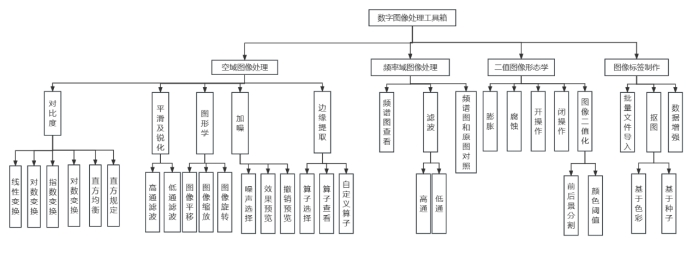 

将图像处理部分所学内容集成到可视化界面中，能通过可视化界面调整参数并显示处理结果，具体功能包括：

1.主界面：

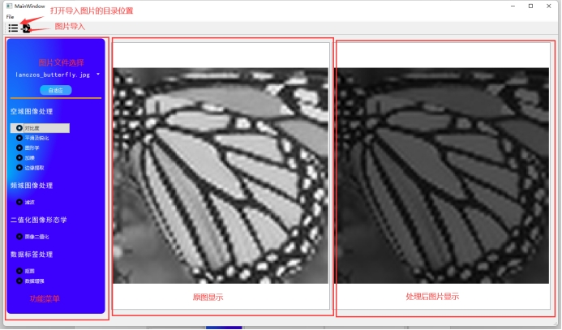 

两侧图片均可滚轮缩放。

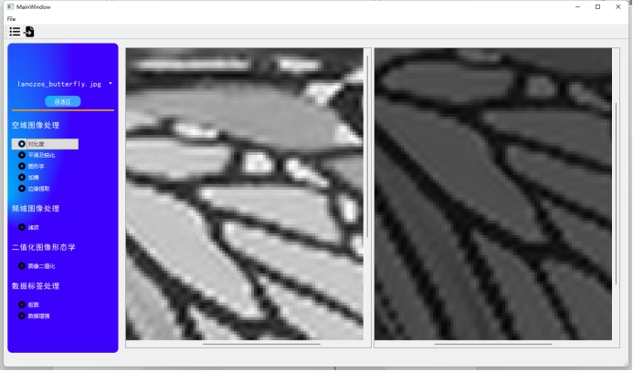 

菜单栏图片导出：

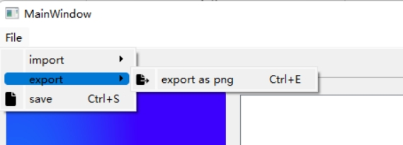 

 

文件导入支持批量导入：

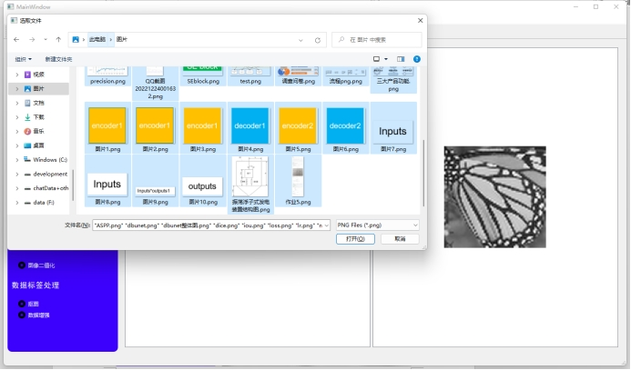 

当前已经导入的文件列表查看：

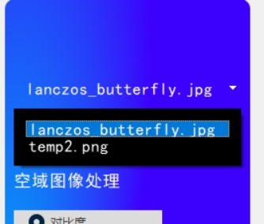 

导入不能有中文路径

图片自适应窗体大小

 

2.子页面：

点击菜单项呼出子页面

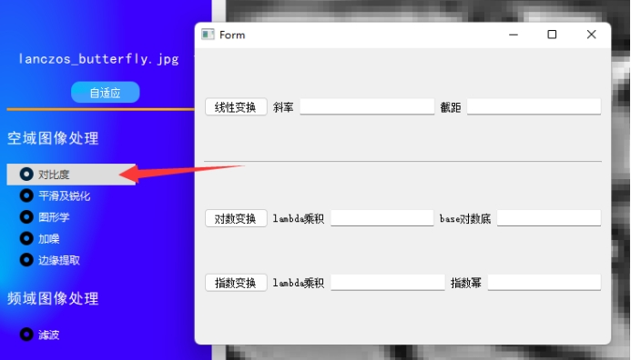 

子页面主要用于参数输入和方法选择。

1）灰度图像的对比度增强，要求实现线性变换和非线性变换（包括对数变换和指数变换）。

线性变换算法：

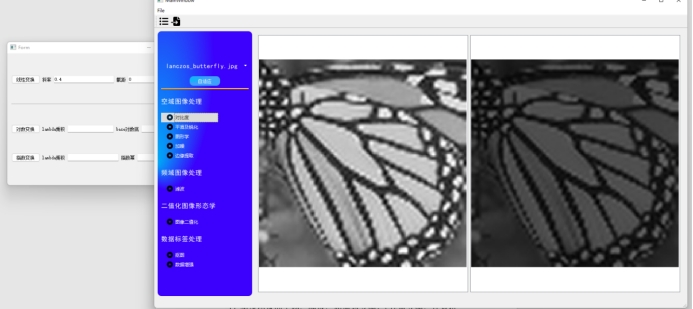 

对数变换算法：

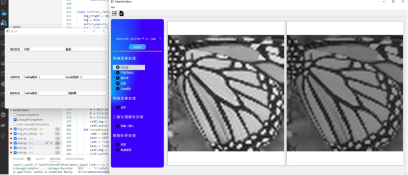 

指数变换算法

 

2) 直方图均衡化和直方图规定化。

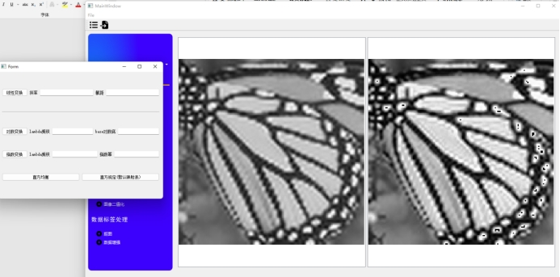 

3) 空间域的图像平滑和图像锐化。

图像平滑和锐化

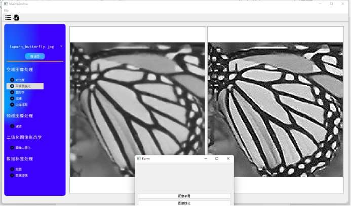 

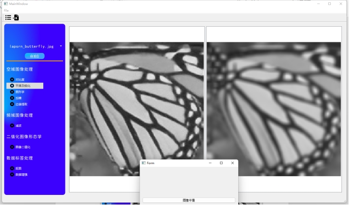 

4）频域图像的高通滤波和低通滤波

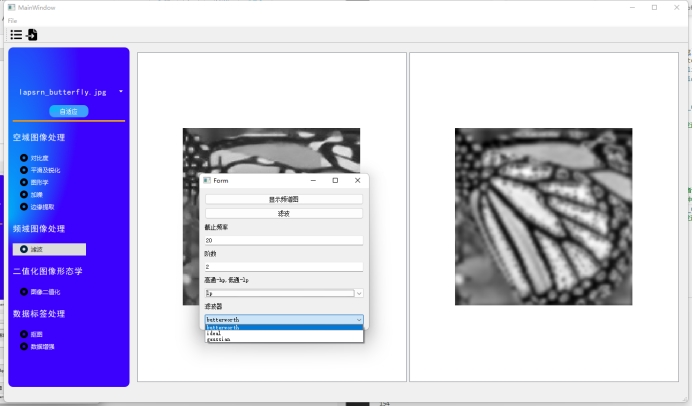 

显示频谱图因为无法查明的错误导致功能无法使用，推测可能是返回值类型和Pyqt图像组件的要求有所出入导致的。

5）实现图像的平移、缩放、和旋转变换。（几何变换，计算机图形学中的内容）

未能实现

6）图像加噪（用图形界面输入参数来控制不同噪声）。

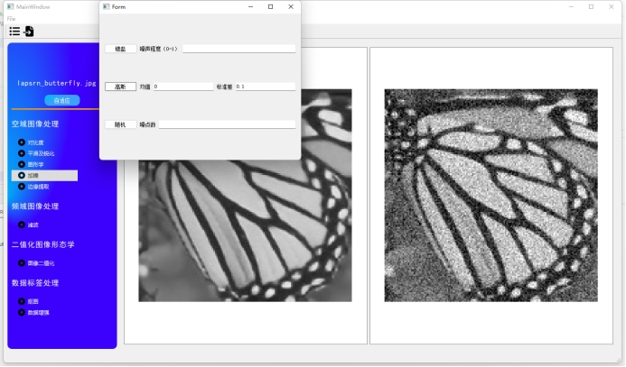 

7）采用roberts算子，prewitt算子，sobel算子，LOG算子对图像进行边缘提取。

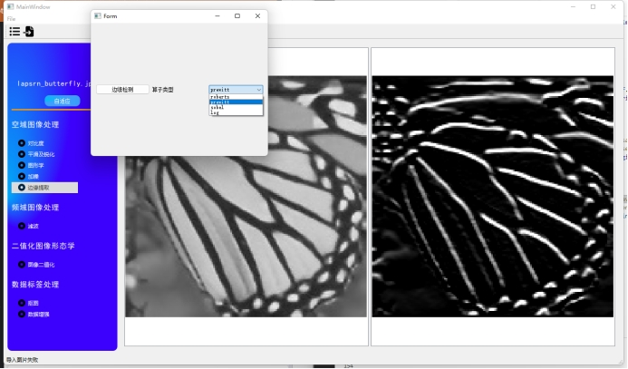 

8）二值图像的形态学处理，至少包括膨胀、腐蚀、开、闭操作。

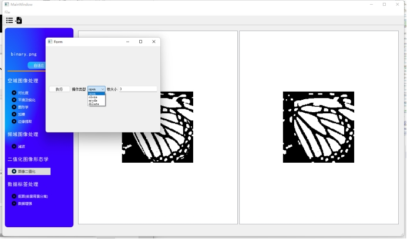 

9）读入一幅为图像（只含有单一目标），应用所学的知识分割出前景目标和背景图像（分割前景和背景）。

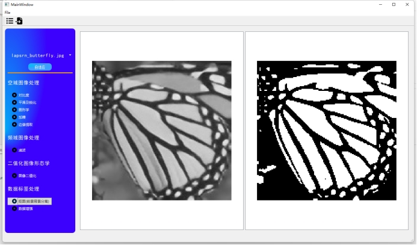 

 

文件导出保存后就能获得二值化图像

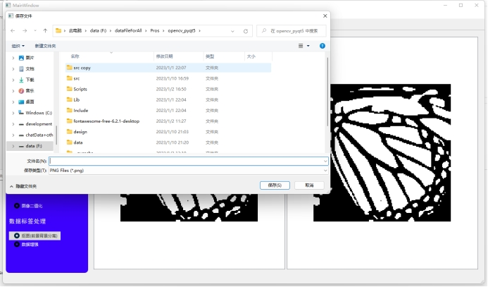 

## 子项目TODO

TODO：加入两个图形学子项目，尝试使用C++来实现，并将cv和gl整合到一个app上，添加导出代码的功能。

QT前端模板选择：flutter风格的QT前端

子项目 opengl_lab 是图形学实验，子项目是 opengl 的 qt 实现。

子项目 open_cv_gl_qt 是该项目的 C++_qt 实现，相比该项目添加了 opengl 的一些图形学功能。

这两个子项目都使用了 C++ 构建工具/包管理工具来管理工程，方便向其他 IDE 迁移（比较常见的 C++ IDE 基本都支持 cmake 工程，xmake 则需要通过一些插件做额外配置）。

### opengl_lab

使用了 vscode + cmake + vcpkg 的开发配置，保留了完整的配置文件，可作为template。

### open_cv_gl_qt

使用了 vscode + xmake + vcpkg + qtcreator 的开发配置，保留完整配置文件，可作为template。

- [x] cmake
- [x] vcpkg
- [x] opengl(glut)
- [ ] xmake
- [ ] QT